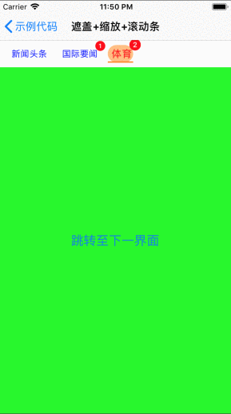
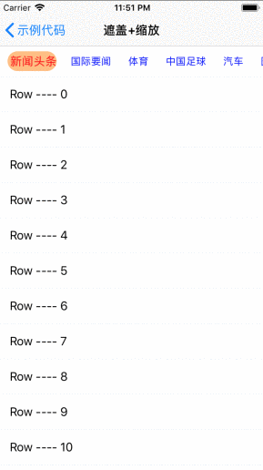
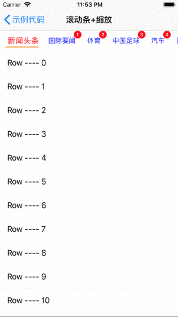
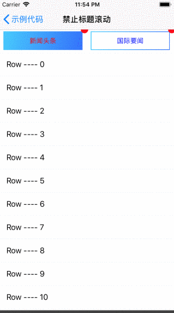
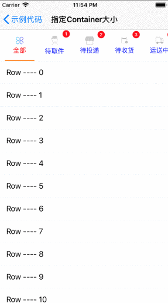
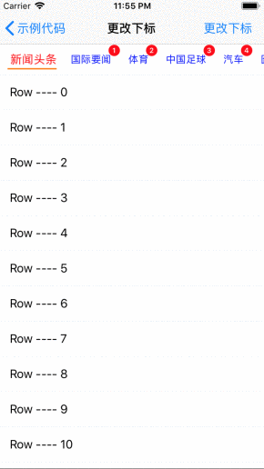
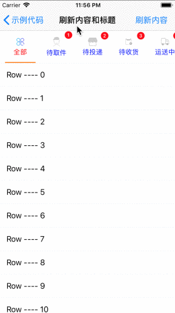

# JSSegmentControl

<p align="center">
<a href="https://github.com/apple/swift"></a>
<a href="https://github.com/apple/swift"></a>
<a href="https://github.com/spirit-jsb/JSSegmentControl"></a>
<a href="https://github.com/spirit-jsb/JSSegmentControl/blob/master/LICENSE"></a>
<a href="https://cocoapods.org/pods/JSSegmentControl"></a>
</p>

## 示例代码

如需要运行示例项目，请 `clone` 当前 `repo` 到本地，并且从根目录下执行 `JSSegmentControl.xcworkspace`，打开项目后切换 `Scheme` 至 `JSSegmentControl-Demo` 即可。

## 示例效果








## 注意事项

⚠️ **请确保重写 `Parent View Controller` 的 `shouldAutomaticallyForwardAppearanceMethods` 参数并返回 `false`，否则会抛出异常信息！** ⚠️

## 限制条件
* **iOS 9.0** and Up
* **Xcode 10.0** and Up
* **Swift Version = 4.0**

## 安装

`JSSegmentControl` 可以通过 [CocoaPods](https://cocoapods.org) 获得。安装只需要在你项目的 `Podfile` 中添加如下字段：

```ruby
pod 'JSSegmentControl', '~> 1.0.0'
```

## 待完成

- [ ]增加 `RxSwift` 接口，便于通过 `RxSwift` 管理数据状态。
- [ ]增加自定义 `Title View` 和 `Content View` 位置的方法。
- [ ]增加允许动态修改 `Title Container View` 中 `Title` 颜色的方法。


## 作者

spirit-jsb, sibo_jian_29903549@163.com

## 许可文件

`JSSegmentControl` 可在 `MIT` 许可下使用，更多详情请参阅许可文件。

